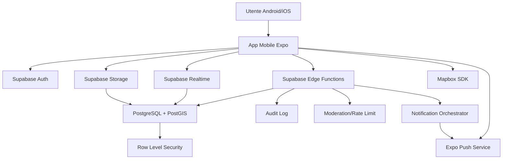
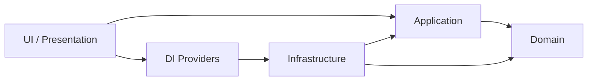
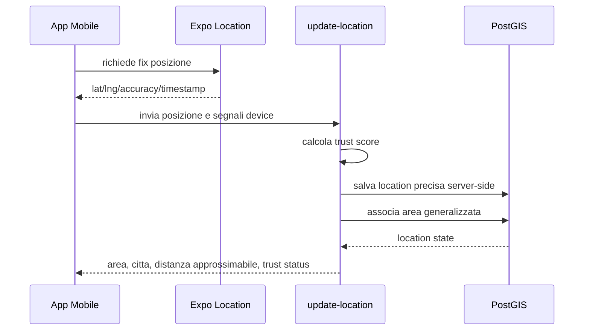
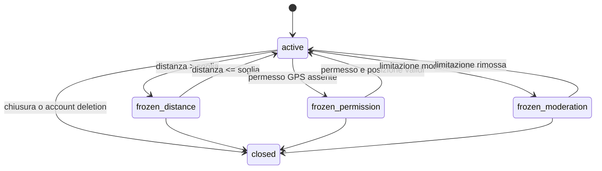

# Paraggi - STEP 2 - Architettura

Versione: 0.1 MVP
Data: 2026-07-09
Stato: pronto per revisione

## 1. Obiettivo dello step

Questo step trasforma l'analisi funzionale in una architettura tecnica pronta a guidare database, backend, mobile app, realtime, geolocalizzazione, chat, testing e deployment.

Il vincolo principale rimane:

> la prossimita fisica e una regola di autorizzazione, non solo un filtro UI.

## 2. Decisioni architetturali principali

- Prodotto primario: app mobile React Native con Expo.
- Navigation: Expo Router.
- Stato client locale: Zustand.
- Server state/cache: TanStack Query.
- Form: React Hook Form.
- Styling: NativeWind.
- Backend: Supabase con Auth, PostgreSQL, PostGIS, Realtime, Edge Functions, Storage e RLS.
- Mappe: Mapbox, scelta consigliata per MVP per heatmap mobile, styling controllato e buona esperienza React Native.
- Push: Expo Push Notifications.
- Monorepo: npm workspaces.
- Architettura applicativa: Clean Architecture con separazione UI, Application, Domain, Infrastructure.
- Fonte di verita geografica: PostgreSQL/PostGIS.
- Build Android testabile: Expo/EAS con profilo APK `preview`.

## 3. Vista sistema



## 4. Monorepo

Struttura prevista:

```text
apps/
  mobile/
    app/                  Expo Router routes
    src/
      presentation/       Screen, componenti, view model UI
      application/        Binding mobile dei casi d'uso
      infrastructure/     Adapter mobile: gps, storage, push
      providers/          Dependency injection e bootstrap
      stores/             Zustand store locali
      queries/            TanStack Query hooks
  admin/
    src/                  Admin panel futuro, non centrale per MVP
packages/
  domain/
    src/                  Entita, value object, policy pure
  application/
    src/                  Use case e port
  infrastructure/
    src/                  Adapter condivisi Supabase/Mapbox/Push
  ui/
    src/                  Theme, primitive, componenti condivisi
supabase/
  migrations/             Schema, funzioni SQL, policy RLS
  functions/              Edge Functions
docs/
  adr/                    Decisioni architetturali
outputs/                  Deliverable per revisione
```

## 5. Clean Architecture

### 5.1 Domain

Contiene logica pura senza dipendenze da Expo, Supabase, React o librerie esterne.

Responsabilita:

- tipi e value object;
- policy di prossimita;
- stati chat;
- categorie post;
- regole TTL;
- regole reputazione;
- invarianti di sicurezza.

Esempi:

- `RadiusMeters`;
- `PostCategory`;
- `ChatStatus`;
- `LocationTrustStatus`;
- `decideChatProximity`, se resta pura e non dipende dal database.

### 5.2 Application

Orchestra casi d'uso usando port/interfacce.

Responsabilita:

- `CreatePostUseCase`;
- `GetNearbyFeedUseCase`;
- `UpdateLocationUseCase`;
- `RequestConnectionUseCase`;
- `RespondConnectionUseCase`;
- `SendPrivateMessageUseCase`;
- `SyncOfflineActionsUseCase`;
- `ExportAccountDataUseCase`;
- `DeleteAccountUseCase`.

L'application layer non conosce dettagli Supabase concreti. Dipende da port come:

- `PostRepository`;
- `LocationRepository`;
- `ChatRepository`;
- `NotificationGateway`;
- `ModerationService`;
- `AuditLogger`.

### 5.3 Infrastructure

Implementa i port con tecnologie reali.

Responsabilita:

- Supabase client;
- Edge Function client;
- Storage avatar;
- Expo Location adapter;
- Expo Push adapter;
- Mapbox adapter;
- secure local storage;
- offline queue persistence;
- realtime subscriptions.

### 5.4 UI

Contiene esperienza utente mobile-first.

Responsabilita:

- schermate Expo Router;
- componenti;
- Zustand store UI;
- TanStack Query hooks;
- React Hook Form schemas;
- NativeWind theme;
- accessibilita;
- dark/light mode.

## 6. Dependency direction



Regole:

- Domain non importa nulla dagli altri layer.
- Application importa Domain.
- Infrastructure puo importare Domain e Application.
- UI usa Application tramite hook/provider e Infrastructure tramite dependency injection.
- Le Edge Functions replicano le policy critiche lato server/database.

## 7. Architettura mobile

### 7.1 Routing

Expo Router:

```text
app/
  _layout.tsx
  (auth)/
    login.tsx
    register.tsx
    forgot-password.tsx
  (onboarding)/
    profile.tsx
    permissions.tsx
    radius.tsx
  (tabs)/
    feed.tsx
    heatmap.tsx
    chats.tsx
    history.tsx
    profile.tsx
  post/
    [postId].tsx
    compose.tsx
  chat/
    [chatId].tsx
  settings/
    privacy.tsx
    account.tsx
    data-export.tsx
```

### 7.2 Stato client

Zustand:

- session bootstrap non sensibile;
- preferenze UI;
- raggio selezionato;
- stato permessi;
- coda offline locale;
- stato composer.

TanStack Query:

- profilo;
- feed vicino;
- dettaglio post;
- commenti;
- richieste private;
- chat list;
- messaggi;
- cronologia aree;
- notifiche.

### 7.3 Offline

Strategia:

- cache lettura con TanStack Query persistence;
- coda azioni offline separata;
- ogni azione accodata contiene payload, timestamp, posizione locale dichiarata e tipo;
- alla sync il backend rivalida posizione, permessi, stato chat e moderazione;
- se la validazione fallisce, l'azione resta rejected con motivo visibile.

## 8. Architettura backend Supabase

### 8.1 Database

PostgreSQL + PostGIS conserva:

- dati relazionali;
- coordinate precise solo lato server;
- aree generalizzate;
- funzioni geografiche;
- policy RLS;
- indici geospaziali.

Tutte le query geografiche usano PostGIS:

- `ST_DWithin`;
- `ST_Distance`;
- `ST_MakePoint`;
- `geography(Point, 4326)`;
- indici GiST.

### 8.2 Edge Functions

Le Edge Functions gestiscono azioni che richiedono validazione server-side forte:

- `update-location`;
- `create-post`;
- `create-comment`;
- `request-connection`;
- `respond-connection`;
- `send-private-message`;
- `sync-offline-actions`;
- `register-push-token`;
- `notify-nearby-users`;
- `export-account-data`;
- `delete-account`.

Motivo:

- evitare che il client aggiri regole;
- centralizzare rate limit;
- scrivere audit log;
- chiamare servizi esterni;
- orchestrare push notifications.

### 8.3 RLS

RLS protegge:

- profili;
- location;
- post;
- commenti;
- richieste;
- chat;
- messaggi;
- notifiche;
- cronologia;
- dispositivi;
- report;
- audit.

Principio:

- il client puo leggere solo viste o righe gia filtrate;
- le azioni sensibili passano da Edge Functions o RPC sicure;
- le coordinate precise non sono selezionabili da query client ordinarie.

## 9. Realtime

Canali previsti:

- `area:{areaId}:posts`;
- `post:{postId}:comments`;
- `user:{userId}:requests`;
- `chat:{chatId}:messages`;
- `chat:{chatId}:status`;
- `user:{userId}:notifications`.

Regole:

- sottoscrizioni aperte solo quando la schermata e attiva o utile;
- payload minimi;
- filtri lato server;
- canali chat autorizzati solo ai partecipanti;
- eventi area aggregati per non esporre utenti precisi.

## 10. Geolocalizzazione

### 10.1 Flusso update posizione



### 10.2 Privacy geografica

Il client non riceve coordinate salvate di altri utenti.

Per feed/chat riceve:

- distanza approssimata;
- area;
- citta;
- stato prossimita;
- tempo aggiornamento generalizzato.

## 11. Chat geofenced

La chat e il punto distintivo del prodotto. Deve essere difesa in tre livelli:

- UI: input disabilitato se stato non active;
- Edge Function: `send-private-message` rifiuta messaggi se chat non active;
- Database/RLS/RPC: funzioni PostGIS verificano distanza tra ultime location affidabili.



## 12. Notifiche

Expo Push Notifications viene usato con token associati a device.

Flusso:

1. app richiede consenso;
2. app registra device e push token;
3. backend salva token;
4. eventi applicativi generano record notification;
5. Edge Function invia push;
6. app aggiorna stato in-app.

Payload push:

- non include coordinate;
- non include contenuti sensibili completi;
- usa deep link verso schermata autorizzata.

## 13. Mappe e heatmap

Scelta: Mapbox.

Motivi:

- controllo avanzato dello stile;
- supporto heatmap;
- buona resa mobile;
- possibilita di visualizzare aree aggregate senza marker utente;
- adattabilita dark/light mode.

Uso MVP:

- heatmap zone attive;
- nessun marker persona;
- nessuna posizione precisa;
- celle/aree aggregate con soglia minima di anonimato.

## 14. Strategia APK Android

L'utente ha richiesto un APK testabile facilmente su Android. L'architettura prevede due canali:

### 14.1 Sviluppo rapido locale

Comando previsto:

```bash
npm run mobile:android
```

Richiede:

- app Expo creata nello STEP 5;
- Android device/emulator;
- Expo dev build se servono moduli nativi Mapbox.

### 14.2 APK installabile

Comando previsto:

```bash
npm run mobile:build:apk
```

Implementazione prevista in `apps/mobile/eas.json`:

```json
{
  "build": {
    "preview": {
      "android": {
        "buildType": "apk"
      }
    }
  }
}
```

Output atteso:

- APK scaricabile da EAS;
- profilo `preview`;
- variabili ambiente non sensibili;
- backend Supabase di staging.

Nota: l'APK reale verra generato quando lo scheletro Expo e le dipendenze native saranno presenti. Generarlo ora produrrebbe un artefatto vuoto e non rappresentativo.

## 15. CI/CD

GitHub Actions previste:

- lint;
- typecheck;
- unit test;
- migration check;
- Edge Functions check;
- EAS Android preview build manuale;
- EAS iOS build successiva.

Workflow:

```text
pull request
  -> install
  -> lint
  -> typecheck
  -> test
  -> supabase migration dry-run

manual dispatch
  -> EAS Android preview APK
```

## 16. Sicurezza

### 16.1 Principi

- coordinate precise solo server-side;
- RLS obbligatoria;
- Edge Functions per write critiche;
- audit log per azioni sensibili;
- rate limiting per utente/device/IP quando disponibile;
- storage avatar isolato;
- push payload minimali.

### 16.2 Threat model MVP

Minacce principali:

- GPS spoofing;
- scraping feed;
- spam;
- molestie;
- accesso a chat non autorizzate;
- leak coordinate;
- abuso notifiche;
- furto token.

Mitigazioni:

- location trust score;
- PostGIS server-side;
- RLS;
- canali realtime filtrati;
- rate limit;
- block/report;
- audit;
- secure token storage;
- app integrity checks dove disponibili.

## 17. Osservabilita

Logging:

- Edge Function invocation;
- errori applicativi;
- eventi audit;
- rate limit;
- anomalie GPS;
- stato chat frozen/reactivated.

Metriche prodotto anonime:

- post creati;
- commenti;
- richieste private;
- chat attive/congelate;
- aree attive;
- retention.

## 18. Testing architecture

Unit test:

- domain policy;
- use case application;
- mapper e validator.

Integration test:

- Edge Functions;
- RLS;
- PostGIS query;
- realtime authorization.

E2E:

- onboarding;
- feed;
- post/commento;
- richiesta privata;
- chat active/frozen/reactivated;
- offline sync.

## 19. Artefatti creati in questo step

- `package.json` root con npm workspaces.
- `tsconfig.base.json`.
- `packages/domain`.
- `packages/application`.
- `packages/infrastructure`.
- `packages/ui`.
- `README.md` iniziale.
- `docs/02-architettura.md`.
- ADR iniziali in `docs/adr`.

## 20. Gate per procedere allo STEP 3

Prima del database confermare:

- monorepo con npm workspaces;
- Mapbox come scelta mappe;
- Edge Functions per azioni sensibili;
- RLS come difesa primaria;
- APK Android tramite EAS profilo `preview`;
- Supabase staging come ambiente usato dal primo APK testabile.

