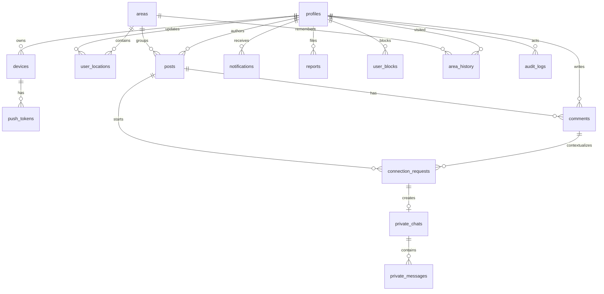

# Paraggi - STEP 3 - Database

Il database e implementato in `supabase/migrations/202607090001_initial_schema.sql`.

## Copertura

- `profiles`
- `devices`
- `push_tokens`
- `areas`
- `user_locations`
- `posts`
- `comments`
- `connection_requests`
- `private_chats`
- `private_messages`
- `notifications`
- `reputation_events`
- `user_badges`
- `reports`
- `user_blocks`
- `area_history`
- `audit_logs`
- `rate_limits`

## PostGIS

Tutti i dati geografici precisi sono salvati come `geography(Point, 4326)` e indicizzati con GiST.

Funzioni principali:

- `latest_trusted_location(user_id)`
- `get_nearby_posts(radius_meters, page_limit)`
- `refresh_chat_status(chat_id)`

## Privacy

Le coordinate precise restano lato database/backend. Il client riceve distanza approssimata, area e citta.

## RLS

RLS e abilitata su tutte le tabelle applicative. Le tabelle sensibili sono leggibili solo dal proprietario o tramite RPC/Edge Functions controllate.

## ER Diagram

